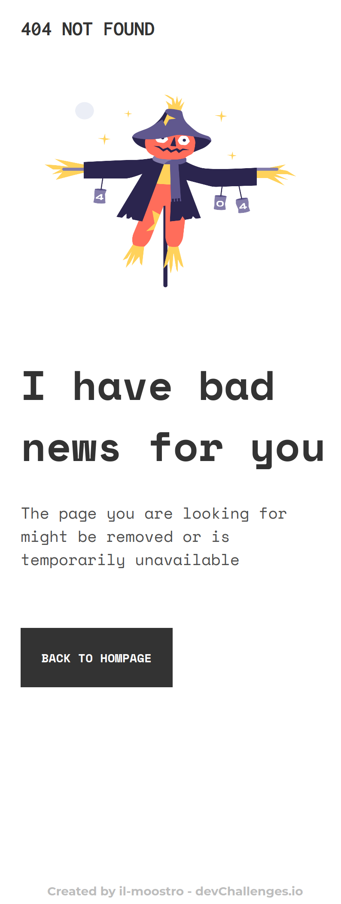
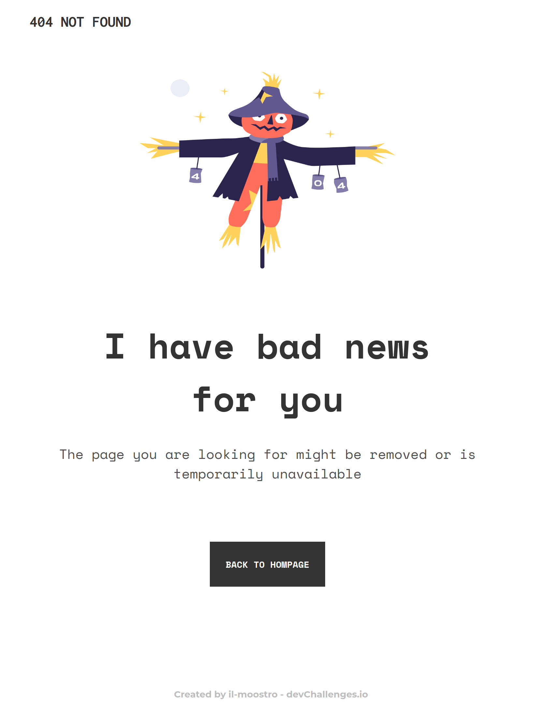
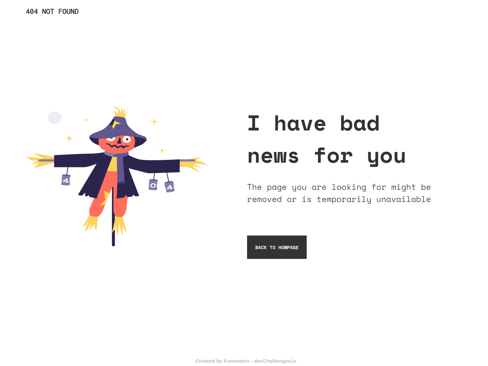

<h1 align="center">404 not found</h1>

   Solution for a challenge from  <a href="http://devchallenges.io" target="_blank">Devchallenges.io</a>.

  <h3>
    <a href="https://il-mostroo.github.io/DevChallengesio.404-not-found/">
      Demo
    </a>
     | 
    <a href="https://devchallenges.io/challenges/wBunSb7FPrIepJZAg0sY">
      Challenge
    </a>
  </h3>

## Table of Contents

- [Overview](#overview)
  - [Built With](#built-with)
- [Features](#features)
- [Contact](#contact)
- [Acknowledgements](#acknowledgements)

## Overview

- You can see a live demo of this web page on the DEMO link at the top of the description. This was my first challenge from the website devChallenges, it was very funny and quite diffucult to me since it was the first time ever i deal with responsivness. I learned plenty of things and new concepts like the how to think responsively, the difference between responsive and fluid design, min(),max() and clamp() functions that are so important, and also how to properly add media queries and custom properties.

### Built With

- Html
- Css

## Features

This application/site was created as a submission to a [DevChallenges](https://devchallenges.io/challenges) challenge. The [challenge](https://devchallenges.io/challenges/wBunSb7FPrIepJZAg0sY) was to build an application to complete the given user stories.

## Contact

- GitHub [@your-username](https://{github.com/il-moostro})
